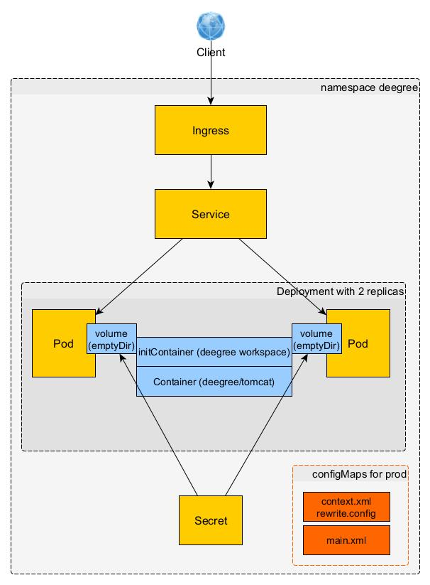

#

Deegree im Kubernetes Cluster
=============================

## Inhalt
* [Einleitung](#einleitung)
* [Deegree Workspace InitContainer](#deegree-workspace-initcontainer)
* [Deegree WebApp MainContainer](#deegree-webapp-maincontainer)
* [kubectl Namespace](#kubectl-namespace)
* [kubectl Content](#kubectl-content)
* [Summary](#summary)


## Einleitung
Im Repository [deegree-docker](https://github.com/enatdvmv/deegree-docker) haben wir uns damit beschäftigt, wie wir deegree in einem Docker Container bereitstellen. Jetzt gehen wir einen Schritt weiter. Dabei wird das Docker-Image über eine Jenkins-Pipeline gebaut, in einem Artifactory gespeichert und die Container werden in einem Kubernetes-Cluster ausgeführt. Wir konzentrieren uns hier auf den letzten Teil, wie wir deegree in einem Kubernetes-Cluster zum Laufen bringen.

Im einfachsten und unkompliziertesten Fall bauen wir uns ein einziges Image mit *tomcat:9-jdk8*, *1…n* deegree WebApps und *1…n* deegree Workspaces. Hier wollen wir einen anderen Ansatz wählen. Wir bauen uns ein MainImage mit *tomcat:9-jdk8* und einer deegree WebApp sowie 1…n InitialImages mit jeweils einem deegree Workspace. Dann läuft jeder deegree Workspace über eine separate deegree WepApp in eigenen Kubernetes Pods.


## Deegree Workspace InitContainer
Zunächst müssen wir uns Gedanken darübermachen, wie wir den deegree Workspace in den Pods zugänglich machen und Datenbank Username/Passwort setzen. Wir behalten im Hinterkopf, das die deegree Dienste im Kubernetes Cluster nicht bearbeitet werden. Das erfolgt ausschließlich lokal. Nach einem Git-Commit wird die Jenkins-Pipeline aktiviert und es steht ein neues Image für den InitialContainer bereit.

Der deegree Workspace wird dazu im [Dockerfile](Dockerfile) aus dem Docker-Context in einen InitContainer kopiert. Im Kubernetes [Deployment](kubernetes/deegree3-deployment.yml) wird ein *emptyDir* gemountet und Kubernetes angewiesen, den Workspace aus dem InitContainer in dieses Volume zu kopieren, welches anschließend auch auf den MainContainer gemountet wird *(vgl. Abb. 1)*. Jeder Pod verfügt über dieses Volume, welches an die Lebenszeit des Pods geknüpft ist.

Username und Passwort werden in einem Secret gespeichert *(base64)*. Wie kommen diese nun in das jdbc-Konfigurationsfile im deegree Workspace? Dazu legen wir im [Deployment](kubernetes/deegree3-deployment.yml) 2 Umgebungsvariablen an und verknüpfen sie mit dem Secret. Deegree interpretiert diese aber beim Lesen des jdbc-Konfigurationsfiles nicht. Deshalb weisen wir Kubernetes im [Deployment](kubernetes/deegree3-deployment.yml) an, im Lifecycle postStart, die Werte mit dem Shell Kommando *sed -i* zu setzen. Beide Probleme haben wir damit gelöst.

Es ist noch darauf hinzuweisen, dass wir rekursiv, sämtliche XSD-Schemata lokal im deegree Workspace unter *appschemas* vorhalten müssen, da aus den Pods kein http/https Zugriff auf die Schemata möglich ist.


## Deegree WebApp MainContainer
Zunächst ist wichtig, dass unser MainContainer nicht mit *root*-Rechten läuft. Dazu erstellen wir im [Dockerfile](Dockerfile-MainContainer) *group* und *user* *tomcat*. Und lassen den Container als *USER tomcat* laufen.

Das aktuelle *deegree-webservices.war* laden wir im [Dockerfile](Dockerfile-MainContainer) herunter und entpacken es. Zunächst in einem temporären Verzeichnis. Alternativ können, wie in unserem Beispiel, beide Schritte auch im Jenkinsfile vorweggenommen werden. Und zwar deshalb, weil die Kommandos *curl* und *unzip* in der Umgebung für den Image-Bau nicht zur Verfügung stehen.
```
stage('Get App-Content') {
            environment { 
                DEEGREE_VERSION = "3.4.32"
            }
            steps {
                echo "Get deegree App Content from Artifactory..."
                sh "curl https://repo.deegree.org/content/repositories/public/org/deegree/deegree-webservices/${env.DEEGREE_VERSION}/deegree-webservices-${env.DEEGREE_VERSION}.war -o deegree-webservices.war"
	            sh "unzip -q deegree-webservices.war -d ./deegree-webservices/"
	            sh "rm -r ./deegree-webservices.war"
            }
}
	
stage('Docker Build Image') {
            steps {
                echo "building Docker image..."
                script {
                    def dockerfile = 'Dockerfile'
                    pomVersion = sh(returnStdout: true, script: 'mvn help:evaluate -Dexpression=project.version -q -DforceStdout').trim()
                    dockerImageName = "${DOCKER_REGISTRY}/docker-dev/deegree3-test-k8s:${pomVersion}"                  
	                def customImage = docker.build("${dockerImageName}", "-f ${dockerfile} --build-arg target_app=deegree-webservices .")
                }
            }
}
```

Für den produktiven Betrieb der deegree WebServices benötigen wir noch 2 weitere Dateien *(context.xml, rewrite.config)*. Beide Dateien wurden über den InitContainer in das Volume kopiert. Diese über configMaps bereitzustellen funktioniert nicht, da der Mount der configMaps vor dem Entpacken des *deegree-webservices.war* im Tomcat erfolgt. Deshalb haben wir das *war*-File zunächst in einem temporären Verzeichnis entpackt. Und weisen Kubernetes im [Deployment](kubernetes/deegree3-deployment.yml) an, beiden Dateien dort hinzuzufügen, alles wieder als *war*-File zu verpacken und in den Tomcat zu verschieben.


## kubectl Namespace
Zunächst legen wir uns einen Namespace *deegree* an.
```
kubectl get namespaces
kubectl apply -f D:\kubernetes\deegree3-namespace.yml
```
Schauen uns die Konfiguration an.
```
kubectl config view
kubectl config current-context
```
Definieren den neuen Kontext für kubectl und wechseln in diesen Namespace.
```
kubectl config set-context deegree --namespace=deegree --cluster=myClusterName --user=myUserName
kubectl config use-context deegree
kubectl config current-context
```


## kubectl Content
Wir legen im Namespace *deegree* ein Secret, ein Deployment mit 2 Replicas, ein Service sowie ein Ingress an *(vgl. Abb. 1)*.
```
kubectl apply -f D:\kubernetes\deegree3-secret.yml
kubectl apply -f D:\kubernetes\deegree3-deployment.yml
kubectl apply -f D:\kubernetes\deegree3-service.yml
kubectl apply -f D:\kubernetes\deegree3-ingress.yml
```

Abb. 1: deegree im Kubernetes Cluster


Inspizieren unsere neuen Objekte.
```
kubectl get secret deegree3-secret -o yaml
kubectl get pods
kubectl get services
kubectl get ing
```
Sehen uns in den Pods um.
```
kubectl exec -it myPodName -- /bin/sh
cd webapps
ls -l
cd /var/lib/tomcat/.deegree
ls -l
exit

kubectl logs myPodName
```
Testen ob die Pods arbeiten.
URL: http://localhost:8080/deegree-webservices/console/webservices/index.xhtml
```
kubectl port-forward myPodName 8080:8080
```
Testen den Service, ebenfalls auf localhost:8080.
```
kubectl port-forward service/deegree3-service 8080:8080
```
Und schauen ob die deegree Konsole auch von außerhalb des Kubernetes Clusters angesprochen werden kann. Dazu verwenden wir die Address aus dem Ingress.
URL: http://myHost/deegree-webservices/console/webservices/index.xhtml

Und testen die beiden deegree Web-Services (WMS und WFS) in QGIS. Bzw. den WFS über einen GetFeature-Request.
URL: http://myHost/deegree-webservices/services/inspire_us_schulstandorte_download?service=WFS&version=2.0.0&request=GetFeature&typeName=us-govserv:GovernmentalService&Count=10


## Summary
In diesem Repository haben wir einen Lösungsweg aufgezeigt, wie deegree WebServices in einem Kubernetes-Cluster betrieben werden können. Dazu haben wir einen Weg über InitialContainer gewählt, was im Deployment für etwas Getüttel sorgt. Der einfachere Weg, alles in einem einzigen Container, erscheint mir daher im Nachhinein als die bessere Alternative. I.d.F. erhöhen wir dann die Anzahl der Replicas.
